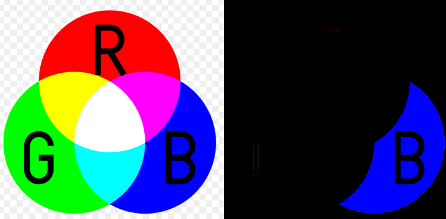

DETECT COLOR IN AN IMAGE
========================

Example
=========================
Detect Blue Color



Usage
=====

Add the range of color that you want to detect
```python
  boundaries = [
   ([0, 0, 0], [255,50, 50]), #blue
  # ([0, 0, 0], [50,255, 50]), #green
  # ([0, 0, 0], [50,50, 255]), #red
  ]
```

Launch the program with example image

```sh
  $ python launcher.py 
```

Launch the program with your custom image

```sh
  $ python launcher.py --image path-image
```


License
=======
This project is licensed under the GPL V3 License - see the [LICENSE](LICENSE) file for details
